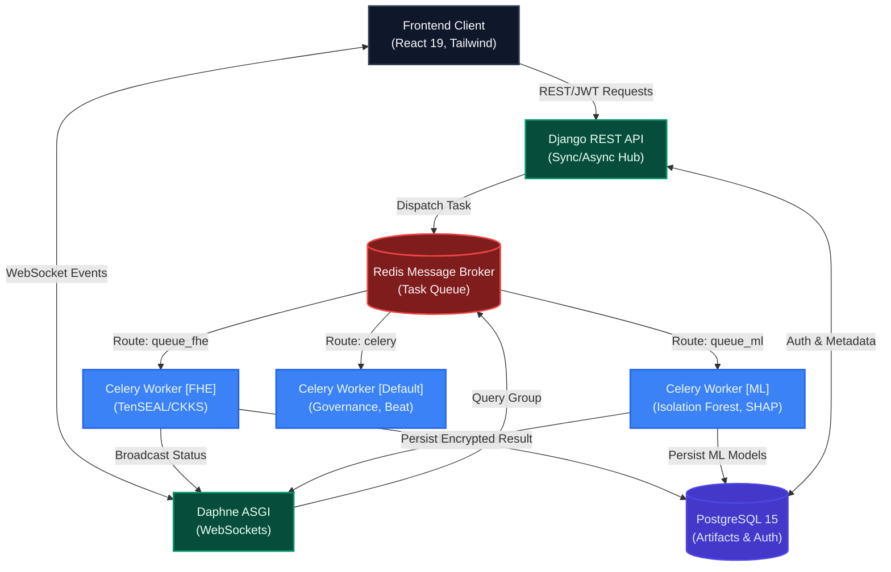
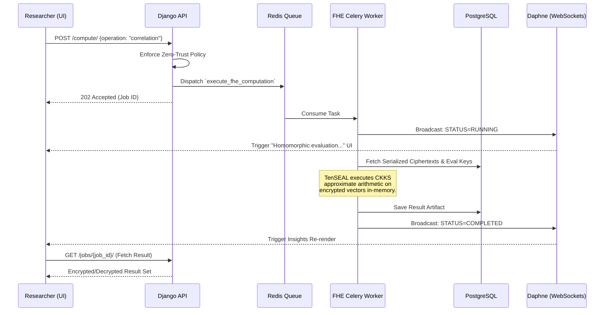

<div align="center">
  
# 🔐 Cipher Analytics  
**Enterprise-Grade Homomorphic Data Analytics & Zero-Trust Governance Platform**

[](https://www.djangoproject.com/)
[](https://reactjs.org/)
[](https://www.postgresql.org/)
[](https://docs.celeryq.dev/)
[](https://www.docker.com/)

> **Compute on encrypted data. Never expose raw values. Verify zero-knowledge computations.**

</div>

---

Cipher Analytics is a secure, zero-trust data processing platform designed for institutions, researchers, and enterprises. It enables the execution of statistical analysis and machine learning workloads on sensitive datasets **without decrypting them on the server**.

This platform demonstrates the applied use of **Fully Homomorphic Encryption (FHE)** integrated into a production-ready, distributed backend system with an elite, academic-grade frontend user experience.

---

## 🚨 The Privacy-Utility Tradeoff

Traditional systems require decrypting data before computation, exposing plaintext in memory. This introduces critical security vulnerabilities, insider threats, and compliance risks (GDPR, HIPAA).

**Cipher Analytics solves this by ensuring:**
1. Data is encrypted before storage and remains encrypted during rest and transit.
2. **Backend memory never handles raw numeric values directly during arithmetic operations.**
3. A zero-trust governance layer dictates strict access policies (Strict, Whitelist, Aggregated) to mitigate inference attacks.

---

## 🏗 Distributed System Architecture

The platform is engineered around an asynchronous, event-driven microservices architecture, built to handle the immense computational overhead of homomorphic encryption seamlessly.



---

## 🔐 Cryptographic Execution Flow

How does a computation actually happen without exposing data?



---

## 📊 Analytical & ML Capabilities

| Capability | Underlying Engine | Security Posture | Output Visualization |
|------------|-------------------|------------------|----------------------|
| **Descriptive Statistics** | TenSEAL (CKKS) | `FHE Executed` | Raw Numeric Output |
| **Pearson Correlation** | TenSEAL (CKKS) | `FHE Executed` | Dynamic Matrix Heatmap |
| **Outlier Detection** | Scikit-Learn (Isolation Forest) | `Encrypted Persistence` | Scatter Plot / Table |
| **Explainable AI (SHAP)** | SHAP TreeExplainer | `Model Extraction` | Dependency Bar Charts |

---

## 🛡️ Zero-Trust Governance Models

To prevent statistical inference attacks and ensure data owners maintain absolute sovereignty, the system enforces strict governance policies:

| Policy Mode | Description | Security Constraints |
|-------------|-------------|----------------------|
| **`STRICT`** | Highest security tier. Requires an explicit, active **Research Grant** approved manually by the Data Owner. | Time-bound access, explicit revocation, full audit trails. |
| **`WHITELIST`** | Enterprise tier. Requires the user to be pre-authorized in the dataset's internal access registry. | Bypasses individual grants but requires admin provisioning. |
| **`AGGREGATED`** | Hardened metadata-driven tier. Allows limited computation to any authenticated user. | Enforces **k-anonymity** thresholds, rejects high-cardinality probing, restricts subset filtering. |

---

## 🎨 Enterprise UI/UX Design

The frontend has been meticulously crafted to resemble elite academic and research platforms:
- **Academic White Theme**: A clean, minimalist aesthetic prioritizing data legibility and focus.
- **Glassmorphism & Depth**: Subtle backdrops, ultra-light borders, and deep shadows (`shadow-2xl`) to create visual hierarchy without clutter.
- **Micro-Animations**: Real-time pulse indicators for enclave status, staggered fade-ins (`animate-in fade-in zoom-in`), and progress bars that respond to WebSocket state changes.

---

## ⚙️ Technology Stack Deep-Dive

### Backend & Cryptography
- **Django 5 + DRF**: The robust API backbone.
- **Celery + Redis**: Distributed asynchronous task execution, segregated into specialized queues (`queue_fhe`, `queue_ml`).
- **Django Channels + Daphne**: ASGI-powered WebSockets for real-time, bidirectional computation state tracking.
- **TenSEAL (CKKS)**: Microsoft SEAL wrapper. Configured with Poly Modulus Degree `8192` and Scale `2^40` for precise floating-point arithmetic.
- **PostgreSQL 15**: Relational integrity and BLOB storage for serialized ciphertexts and evaluation keys.

### Frontend
- **React 19 + Vite**: High-performance, unbundled development.
- **TailwindCSS**: Pure utility-first styling avoiding heavy component libraries.
- **Recharts**: Complex, responsive SVG charts for ML insights.
- **Local Storage L2 Cache**: Prevents redundant API calls for highly intensive FHE computations.

---

## 🚀 Getting Started

The entire stack is containerized for seamless local deployment.

### Prerequisites
- Docker & Docker Compose
- Git

### Deployment

```bash
# 1. Clone the repository
git clone https://github.com/your-username/cipher-analytics.git
cd cipher-analytics

# 2. Start the distributed cluster (Detached mode)
docker-compose up --build -d

# 3. Monitor background workers and task queues (Optional)
# Access Celery Flower at: http://localhost:5555
```

### Accessing the Application
- **Frontend UI**: `http://localhost:5173`
- **Backend API**: `http://localhost:8000/api/`

---

## 🔮 Future Roadmap

- **Client-Side Encryption**: Push the encryption/decryption boundary directly to the React client (via WebAssembly SEAL integration) to achieve a mathematically verified Zero-Knowledge architecture.
- **Secure Key Management (KMS)**: Integration with HashiCorp Vault for secure evaluation key rotation and storage.
- **Multi-Key FHE**: Enabling collaborative computation across datasets encrypted with disparate public keys.

---

## 💡 Why This Project Matters

This is not a standard CRUD application. It demonstrates:
- **Applied Cryptography** in a production-ready, distributed pipeline.
- **Distributed Systems Engineering** handling heavy, blocking workloads asynchronously.
- **Enterprise-Grade Architecture Discipline** via decoupled services and robust state machines.
- **Privacy-First Thinking** paving the way for the future of AI and Data Analytics.

<div align="center">
  <br/>
  <i>Systems that require decryption to function are inherently vulnerable. <br/> Cipher Analytics challenges that assumption.</i>
</div>
